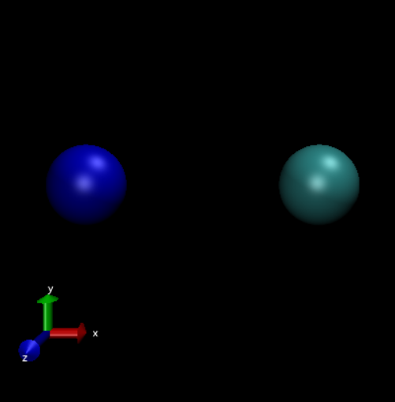
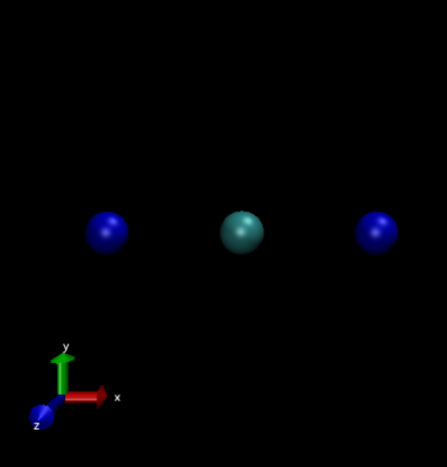
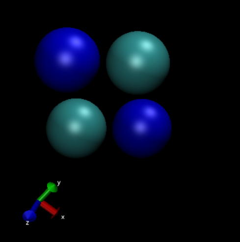
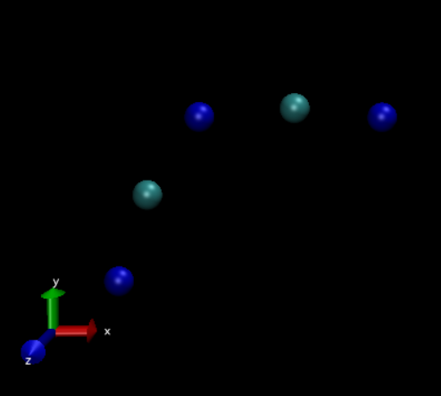
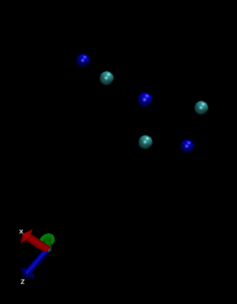

# Genetic-Algorithm-NaCl-Clustering
## Introduction and Theory
This is a solution to problem 11.3 in the book An Introduction to Compuational Physics 2nd Edition by Dr. Tao Pang. 
In this problem, we seek to find the stable geometric structures of a multi-charge cluster of Na and Cl atoms. This problem is the minimization of a potential by means of the genetic algorithm. The potential being:
$$V(r_{ij}) = \eta_{ij}\frac{e^2}{4\pi\epsilon_0 r_{ij}} + \delta_{ij}V_0e^{-r_{ij}/r_0},$$
where $\eta_{ig} = -1$ and $\delta_{ij} = 1$ if $i$ and $j$ are of opposite charge and $\eta_{ig} = 1$ and $\delta_{ij} = 0$ if $i$ and $j$ are of like charge. $V_0 = 1.09\times10^{3} \mbox{ eV}$ and $r_0 = 0.321$ Angstroms. To reduce computational costs, the first particle in our system does not move throughout all generations, the second is limited to the x-axis, and the third is limited to the x and y axes. The rest of the particles are allowed to move in all axes.
## Results
All results were visualized with Visual Molecular Dynamics (VMD 1.9.3)
### 1 Na 1 Cl

### 2 Na 1 Cl

### 2 Na 2 Cl

### 3 Na 2 Cl

### 3 Na 3 Cl

